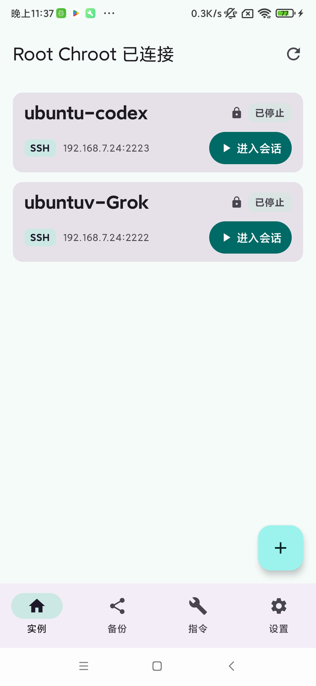
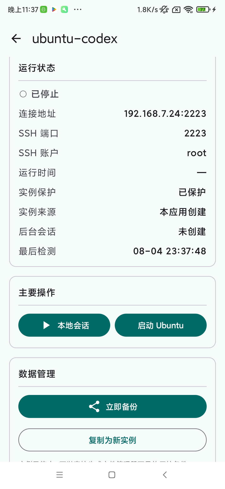
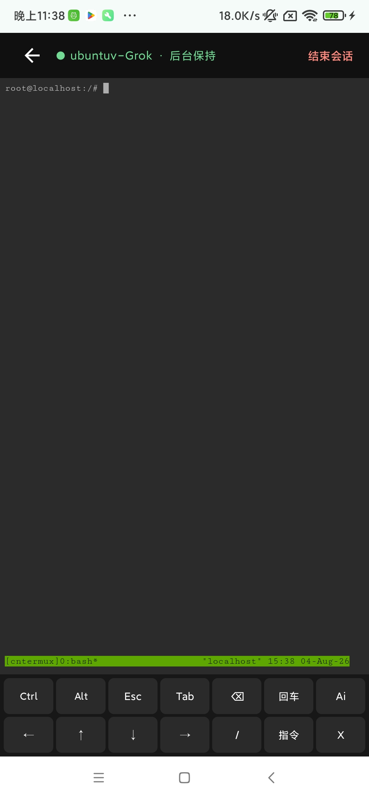
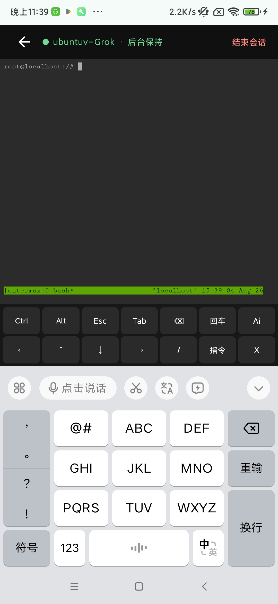
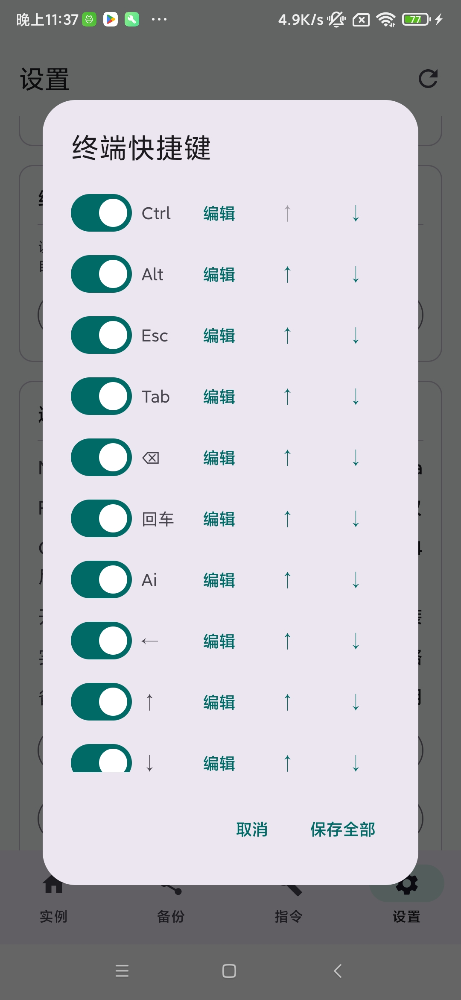
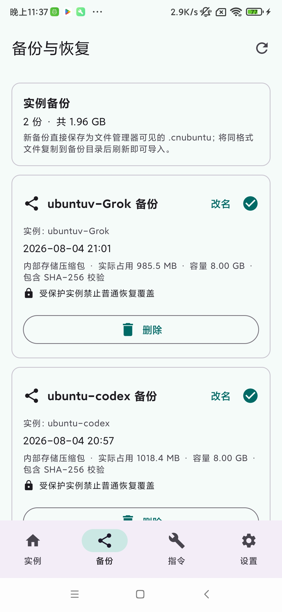
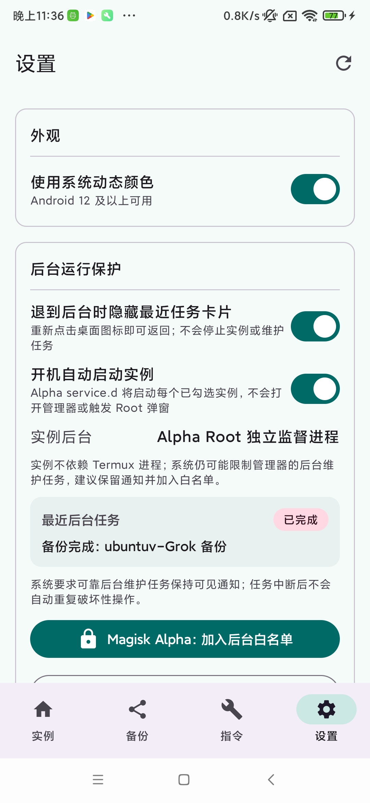

# Ubuntu 管理器（Root Chroot）

面向已取得 Magisk Alpha Root 的 Android 设备的中文 Ubuntu Chroot 管理器。
运行时不依赖 Termux、`RUN_COMMAND` 或 `proot-distro`，由 APK 直接通过 Alpha Root
管理 Ubuntu 实例。

## 下载

- [下载最新 ARM64 APK](https://github.com/sqmxhd/Ubuntu_APK_Manager/releases/download/latest/UbuntuManager-latest-arm64-v8a.apk)
- [查看全部正式版本与 SHA-256](https://github.com/sqmxhd/Ubuntu_APK_Manager/releases)

`main` 每次推送后由 GitHub Actions 自动更新 latest APK；`vX.Y.Z` Tag 会自动发布正式
版本。所有 Release APK 均使用固定密钥签名，当前仅支持 ARM64 设备。

## 界面预览

|                      实例管理                      |                       实例详情与主要操作                       |
| :------------------------------------------------: | :------------------------------------------------------------: |
|  |  |

## 架构

```text
Ubuntu 管理器 APK
        ↓ Magisk Alpha su
/data/adb/cntermux/chroot-supervisor.sh
        ↓ 私有 mount namespace
独立 ext4 实例镜像
        ↓
Ubuntu 24.04 / OpenSSH / tmux / ttyd / Nmap
```

开机启动不经过 APK 或 `su`：Magisk Alpha 直接执行
`/data/adb/service.d/cntermux-autostart.sh`，读取经过校验的
`/data/adb/cntermux/autostart.conf` 后启动已勾选实例。

- 每个实例是一块独立的 8GB 稀疏 ext4 镜像，保存该实例的全部系统、软件和用户数据。
- 所有实例共享 Android 宿主网络，因此能直接读取真实网卡和路由，并支持 Root Nmap
  SYN、ARP 等扫描。不同实例必须使用不同的 SSH 端口。
- 每个运行实例使用独立挂载命名空间。`/dev`、`/dev/pts`、`/proc` 和 `/sys` 只在该
  命名空间内挂载，不污染 Android 全局挂载表。
- 本地会话由实例内的 `ttyd + tmux` 提供；离开页面不会结束 tmux 会话，再次进入可继续。
- Chroot 是运行环境，不是安全沙箱。实例内的 `root` 是设备上的真实 Root，只应运行可信程序。

## 本地会话与输入法

本地会话内置可配置的终端快捷键和指令库，可以直接发送 `Ctrl`、`Alt`、方向键、组合键
或自定义命令。快捷键支持启用、禁用、改名、重新排序和编辑按键内容。

目标真机已验证豆包输入法的语音转文字、剪贴板拆词选词以及删除键清空操作；输入法组合文本
和选区替换会按 Android IME 状态同步到终端。

|                    Root Chroot 本地终端                     |                    豆包输入法真机验证                     |
| :---------------------------------------------------------: | :-------------------------------------------------------: |
|  |  |

<p align="center">
  
  <br>
  <sub>终端快捷键可以逐项启用、编辑和调整顺序</sub>
</p>

## 更新记录

### v2.1.1 · 2026-08-06 05:12 CST

本次更新集中优化本地终端历史、实时输出滚动和原生复制体验。

1. 将本地终端的 tmux 历史上限提高到 100,000 行，并扩大终端历史抓取容量。
2. 增加本地会话历史主动刷新链路，查看较早输出时可以获取更完整的终端记录。
3. 修复 Codex 实时输出时强制拉到最下方和页面抖动的问题；查看历史时保持当前位置，位于底部时继续自动跟随。
4. 修复进入 Android 原生复制功能后跳到历史顶部的问题，长按复制会保留当前屏幕位置。
5. 优化滑动、异步历史刷新和原生复制之间的状态协调，避免操作过程中互相抢占滚动位置。
6. 补充大容量历史相关测试，并完成 Debug 单元测试、APK 构建及真机 ADB 验证。

## 实例与备份目录

```text
/data/local/cntermux/
├── images/      # <实例名>.img
├── runtime/     # PID、端口和临时挂载点
├── logs/        # supervisor、sshd 日志
├── backups/     # 仅兼容读取旧版 Root 私有备份
└── cache/       # 已校验的 Ubuntu Base 下载缓存
```

监督脚本安装在 `/data/adb/cntermux/chroot-supervisor.sh`，ARM64 原生维护工具安装在
`/data/adb/cntermux/cntermux-sparsecopy`，负责稀疏复制和按 Chroot 根目录精确清理进程。
实例停止后才能备份、恢复、复制、重命名或
删除。新备份通过原生稀疏区块归档与快速压缩直接保存到
`内部存储/Ubuntu管理器/备份`，文件管理器可以看到并复制 `.cnubuntu` 单文件归档。
恢复时原生工具按区块重建稀疏镜像，不会把8GB逻辑空洞展开成真实空间；归档内含
SHA-256 和元数据。复制器源码位于 `app/src/main/cpp/sparsecopy.c`。

<p align="center">
  
  <br>
  <sub>文件管理器可见的 .cnubuntu 备份、实际占用空间和 SHA-256 校验状态</sub>
</p>

## 开机自动启动

- 设置页提供总开关，每个实例的高级设置提供独立开关。
- Root 配置只接受安全实例名和 1024～65535 的端口，不执行配置中的 Shell 内容。
- 脚本等待 `sys.boot_completed=1`，随后按顺序启动实例，每个实例最多尝试三次。
- 已运行实例返回 `ALREADY_RUNNING`，不会创建第二套挂载或监督进程。
- 开机阶段只启动 Chroot 和 SSH；`ttyd + tmux` 在进入本地会话时按需启动。
- 启动日志位于 `/data/local/cntermux/logs/boot.log`，超过 1MB 时保留一份旧日志。

<p align="center">
  
  <br>
  <sub>后台运行保护、开机自动启动与最近后台维护任务状态</sub>
</p>

## 新建实例

管理器下载 Canonical 官方 Ubuntu Base 24.04.4 ARM64：

`https://cdimage.ubuntu.com/ubuntu-base/releases/24.04/release/ubuntu-base-24.04.4-base-arm64.tar.gz`

内置 SHA-256：

`04207713ece899c3740823d33690441ad3a7f0ded1101aca744e2b0f37ac7ff2`

创建时自动安装 `openssh-server`、`tmux`、`ttyd`、`nmap`、`iproute2`、`procps`、
`ca-certificates` 和 `zstd`。默认 SSH 账户为 `root`，默认密码为 `root1234`，可在实例
高级操作中按需修改。

## 与旧 Termux/PRoot 的关系

本版本不迁移、不读取、不停止，也不删除旧 Termux/PRoot 实例。旧数据仍保留在 Termux
私有目录中，但不会显示在本管理器内。用户确认不再需要后可自行处理 Termux；APK 的
Root Chroot 实例与旧数据没有交叉。

## 构建

```bash
./gradlew test assembleDebug
```

仓库同时提供纯手动运行的 GitLab Docker Runner 与自动运行的 GitHub Actions 工作流。
推送 `main` 会更新滚动 latest Release；推送与 `versionName` 一致的不可变 `vX.Y.Z` Tag
会创建正式 Release。两种流程都会自动完成测试、Lint、Release 签名、签名验证和
SHA-256 生成。Release keystore 只通过 CI Secrets 注入，不保存在 Git 中。详细配置与
操作见 [CI 打包与发布](docs/CI_RELEASE.md)。

最低 Android 8（API 26），当前 APK 面向 ARM64，目标设备验证环境为 Redmi K20 Pro /
Android 11 / Magisk Alpha。
